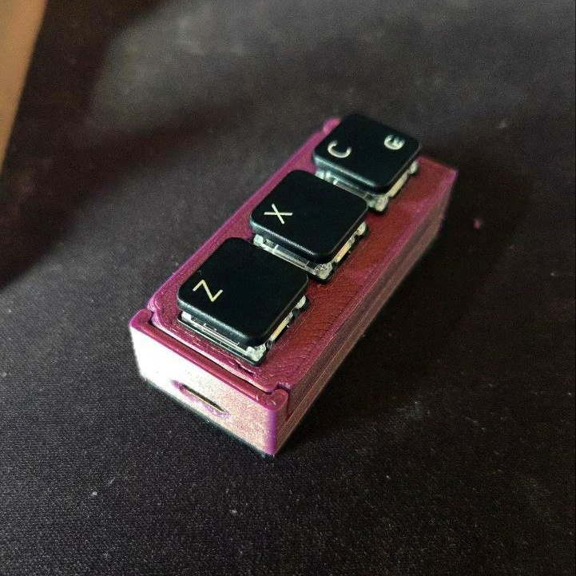
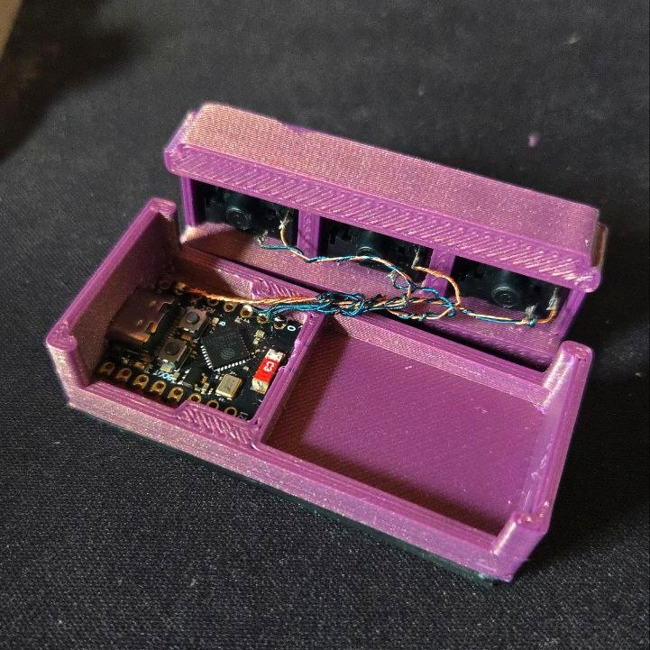

# OSU! Bluetooth Keyboard (ESP32-C3)

Small BLE HID keyboard emulator for playing OSU!. Built for ESP32-C3 and exposes three buttons mapped to Z, X, and C.

## Features
- BLE HID keyboard (BleKeyboard library)
- Three physical buttons: Z, X, C
- Non-blocking debounce logic

## Hardware
- ESP32-C3 (or compatible with BLE HID support)
- 3x momentary switches (active LOW)

Default pin mapping (see src/main.cpp):
- BUTTON_Z_PIN: GPIO 0
- BUTTON_X_PIN: GPIO 1
- BUTTON_C_PIN: GPIO 2
- LED_PIN: GPIO 8 (board led)

## Usage
1. Power the board and open a BLE-capable host (PC/phone).
2. Pair with device named `OSU-Keyboard`.
3. Press Z/X/C buttons to send corresponding keyboard keys.
4. If BLE disconnects, the firmware releases any pressed keys to avoid stuck keys.

## Build & Flash
- Using PlatformIO: open project and upload to your ESP32-C3 board.
- Using Arduino IDE: install required board package and the BleKeyboard library, then upload.

## Notes
- Debounce is implemented in firmware (non-blocking). Adjust DEBOUNCE_MS in src/main.cpp if needed.
- The code sets no extra key delay (bleKeyboard.setDelay(0)) for minimal latency.

## Screenshots / Preview

## License
MIT — modify as needed.
